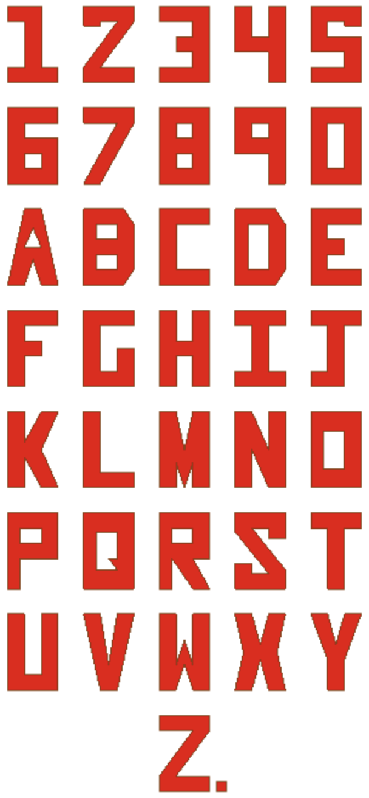

# ESP alphanumeric UDC

This is a silly little UDC that can be used with
[ESP](https://acdl.mit.edu/ESP/) to create blocky, upper case letters and the
numbers 0-9.

To install this udc, copy it into the _$ESP_ROOT/udc_ directory.

NOTE: the _test.csm_ file expects the _alphanumeric.udc_ file to be installed
into the _$ESP_ROOT/udc_ directory to work as-is. If _alphanumeric.udc_ cannot
be installed into _$ESP_ROOT/udc_, it may stay in the same directory as
_test.csm_, but the calls to _udprim_ must be changed from something like:
`udprim $$/alphanumeric char $A` to `udprim /alphanumeric char $A`.

